# Silverfir-nano

## A compact, optimizing WebAssembly JIT for on-device AI.

Silverfir-nano is a `no_std` WebAssembly JIT engine designed around four
things that matter when you want to run AI on edge devices:

1. **Small** — the minimal stripped binary lives in the few-hundred-KB range,
   with zero runtime dependencies and only `alloc` required.
2. **Fast** — not a single-pass baseline JIT. Silverfir-nano emits
   register-allocated, region-optimized native code: on Apple M4 it beats
   Wasmtime's fully-optimizing Cranelift on most workloads and goes
   head-to-head with V8 TurboFan. The same engine, same codegen quality,
   also runs on a Raspberry Pi Pico 2 — an optimizing Wasm JIT on a
   Cortex-M is something the field hasn't really seen before.
3. **Secure** — every guest runs inside the WebAssembly sandbox:
   memory-isolated, capability-gated, portable, and auditable. You ship a
   `.wasm` binary, not a pre-compiled machine-code blob — so the artifact you
   deploy is the same one you can re-verify on-device before it ever runs.
   No native plugins, no ad-hoc FFI trust boundaries.
4. **Updatable** — one `.wasm` blob, one verification surface, atomic swap in
   the field. The runtime stays fixed; models, policies, and agent tools move
   as portable artifacts.

## Why this matters for edge AI

Edge AI devices don't look like servers. They have kilobytes-to-megabytes of
RAM, tight power budgets, and a hard requirement to stay updatable in the
field without becoming a supply-chain incident.

The usual options force a bad trade:

- **Native code per device** — fast, but no sandbox, no portable updates,
  and every shipped binary is a fresh attack surface.
- **Ahead-of-time Wasm toolchains** — portable in theory, but the thing
  you actually ship to the device is a relocatable machine-code binary.
  That artifact is much harder to verify than the original `.wasm`, and a
  corrupted or tampered AOT blob is indistinguishable from a valid one
  without a separate signing and attestation path. You've traded the Wasm
  sandbox for "trust the builder."
- **Pure interpreters on MCU** — tiny and safe, but an order of magnitude
  too slow for anything resembling on-device inference, DSP, or fast agent
  tool use.

Silverfir-nano closes that gap: a single small engine that verifies and
JITs the guest on the device itself, on everything from an M4 laptop to a
tiny MCU.

## One engine, from x86_64 to Cortex-M

Silverfir-nano has four native backends:

- **x86_64**
- **ARM64 (A64)**
- **ARMv7-A (A32)**
- **ARMv7-M and above (Thumb-2)** — tested through ARMv8-M / Cortex-M33

They all share the same frontend, middle-end, and register allocator.
Codegen quality doesn't degrade as you step down to smaller targets: the
same compiler that produces Cranelift-competitive output on Apple M4 also
runs on a Raspberry Pi Pico 2 (RP2350, Cortex-M33), emitting native Thumb-2
into a small executable SRAM arena and running it in place.

Most WebAssembly runtimes aimed at microcontrollers are interpreters, often
with instruction fusion or a threaded dispatcher on top. Silverfir-nano takes
a different route and emits native machine code on the device itself, even
on a Cortex-M.

What makes that credible is not any one trick but the shape of the compiler:

- **The compiler pipeline is streamable end-to-end.** Each IR transform
  stage — Wasm decode, semantic IR, SSA-IR, MachineIR, native emission —
  consumes its input and produces its output incrementally, per function.
  A fully materialized IR for the whole module is never held in memory,
  which is what makes JIT-on-MCU possible at all.
- **The middle-end allocator is designed for JIT budget *and* good
  codegen.** [`ALGORITHM4`](docs/ALGORITHM4.md) is a region-based
  cost-optimal public-cache residency allocator driven by Lagrangian
  relaxation over the structured region tree that Wasm gives for free.
  It runs per-function at JIT scale in a few thousand operations, and
  the output competes with what much heavier optimizing compilers
  produce.

## Performance (Apple M4)

Silverfir vs Wasmtime Cranelift (optimizing JIT) and V8 TurboFan (Node.js 25.4).

### Integer / Control Flow


### Lua Interpreter


### Floating Point


### Memory Bound (STREAM)


See [full benchmark results](benchmarks/wasi/RESULTS.md)

## WebAssembly Compatibility

Silverfir-nano supports all Core WebAssembly 3.0 features and is validated
against the official
[WebAssembly spec testsuite](https://github.com/WebAssembly/spec/tree/main/test).

Supported Core WebAssembly 3.0 feature groups include:

- **Extended constant expressions** — arithmetic in const expressions and
  `global.get` of previously declared immutable globals.
- **Tail calls** — `return_call`, `return_call_indirect`, and
  `return_call_ref`.
- **Multiple memories** — multi-memory definitions, imports, exports, and
  indexed memory operations.
- **64-bit address space** — `memory64`, `table64`, and the corresponding
  `i64`-typed memory/table instruction paths.
- **Typeful references** — typed `ref null`, `ref.func`, `call_ref`,
  `br_on_null`, `br_on_non_null`, refined local initialization rules, and
  typed table initializers.
- **Garbage collection** — recursive types, subtyping, `struct.*`,
  `array.*`, `ref.test`, `ref.cast`, `br_on_cast`, `br_on_cast_fail`,
  `ref.i31`, `any.convert_extern`, and `extern.convert_any`.
- **Baseline SIMD** — `v128` values, loads/stores, lane ops, bitwise ops,
  arithmetic, comparisons, conversions, and the standard SIMD testsuite
  surface currently enabled in-tree.
- **Relaxed SIMD** — relaxed swizzle, relaxed truncation, relaxed min/max,
  relaxed lane-select, relaxed q15mulr, relaxed dot-product, and relaxed
  madd/nmadd.
- **Exception handling** — tags, `throw`, `throw_ref`, and `try_table`.

## Building

```bash
# Default build
cargo build --release

# Run a WASI program
cargo run --release --bin sf-nano-cli -- program.wasm [args...]

# Run benchmarks
python3 benchmarks/wasi/run_tests.py

# Run benchmarks under V8 (Node.js) for comparison
node benchmarks/wasi/run_v8.mjs

# Minimal no_std build
cd sf-nano-cli-minimal && cargo run --release
```

## Validation

Use the Python runner as the canonical validation entry point:

```bash
# Fast day-to-day gate: release build, workspace tests, selected compile checks, and release spectests.
python3 scripts/check.py fast

# Full gate: workspace tests, full feature matrix, target matrix, spectests, and WASI tests.
python3 scripts/check.py full

# Forward extra spectest arguments after --.
python3 scripts/check.py fast -- i32 --log-level info
```

## License

MIT / Apache-2.0
