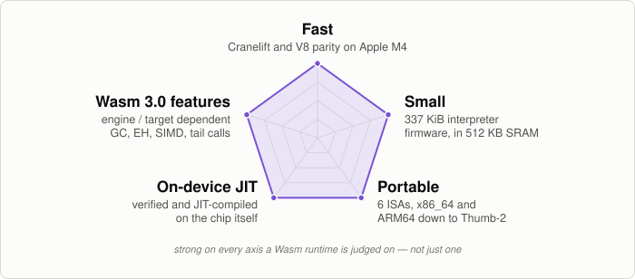
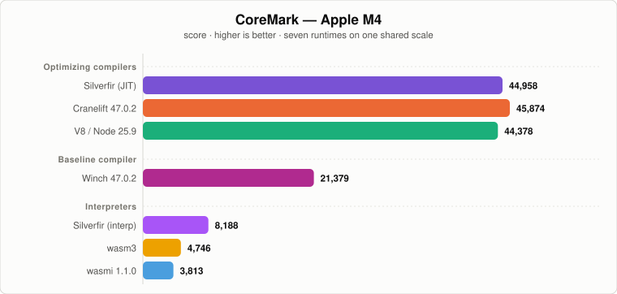

<div align="center">
  <h1>Silverfir-nano</h1>
  <p><strong>A compact WebAssembly 3.0 runtime — an optimizing JIT and an interpreter,
  from desktop to microcontroller.</strong></p>

  <p>
    <a href="https://github.com/mbbill/Silverfir-nano/actions/workflows/check-linux.yml"></a>
    <a href="https://github.com/mbbill/Silverfir-nano/actions/workflows/check-linux-arm.yml"></a>
    <a href="https://github.com/mbbill/Silverfir-nano/actions/workflows/check-macos.yml"></a>
    <a href="https://github.com/mbbill/Silverfir-nano/actions/workflows/check-windows.yml"></a>
    <a href="https://github.com/mbbill/Silverfir-nano/actions/workflows/bench.yml"></a>
  </p>

  <p>
    
    
    
    
  </p>

  <p>
    <a href="#two-engines-one-runtime">Two engines</a> |
    <a href="#performance-apple-m4">Benchmarks</a> |
    <a href="#binary-size">Binary size</a> |
    <a href="#webassembly-compatibility">Wasm compatibility</a> |
    <a href="#validation">Validation</a> |
    <a href="docs/COMPILER_PIPELINE.md">Compiler pipeline</a>
  </p>

  <p>
    
  </p>
</div>

## Highlights

Silverfir-nano is a `no_std` WebAssembly runtime built to be strong on
every axis a Wasm runtime is judged on, not just one. It carries two
engines over one substrate — an optimizing JIT that compiles on the device,
and an interpreter that needs no executable memory — and they share
everything but the way code runs: the same parser, validator, entity model,
and embedder API ([compatibility](#webassembly-compatibility)).

1. **Fast** — register-allocated, region-optimized native code. On Apple M4
   it runs at parity with Wasmtime's fully-optimizing Cranelift and V8
   TurboFan, leading on some workloads and trailing on others
   ([full results](benchmarks/wasi/README.md)).
2. **Small** — pick an engine and pay for what you use. Measured on real
   RP2350 firmware, flash is 337 KiB with the interpreter and 1,042 KiB with
   the JIT ([details](#binary-size)); both run inside the board's 512 KB of
   SRAM. Zero runtime dependencies, `alloc` only, `no_std` throughout.
3. **Portable** — six ISAs, from x86_64 and ARM64 down to RV32 and Thumb-2,
   and *both* engines cover all six. The compiler that competes with
   Cranelift on M4 emits Thumb-2 on a Cortex-M33 — codegen quality doesn't
   degrade as you step down.
4. **Full Wasm 3.0** — GC, exception handling, SIMD and relaxed SIMD, tail
   calls, memory64, multi-memory, typeful references, and extended constant
   expressions. The JIT passes 100% of the official Wasm spec testsuite; the
   interpreter passes 100% of it less SIMD and GC.
5. **On-device JIT** — verification and code generation both happen on the
   target itself. You ship a `.wasm` artifact, not a relocatable machine-code
   blob; the runtime verifies and JITs it on the chip, even on a Cortex-M.
   Where W^X or a tighter flash budget rules that out, the interpreter runs
   the same modules with no executable memory at all.

## Two engines, one runtime

Everything above the execution engine is shared: parsing, validation, the
type and entity model, memories, tables, globals, tags, and the embedder
API. The engines differ only in what they do with a validated function body.

- **The JIT** compiles it to native machine code, on the device, at
  instantiation. It is the default and the full Wasm 3.0 engine.
- **The interpreter** predecodes it into a folded stack machine and runs it
  through a threaded dispatcher generated at build time for the target ISA.
  No executable memory is ever requested.

Neither is a fallback for the other, and both are built for all six ISAs —
an ISA with no backend fails the build rather than silently degrading.
Which engines exist in a build is a Cargo feature (`jit`, `interp`, or both,
the default); when both are compiled in, the choice is a `Tier` on the
`Engine` at runtime. Embedder code is identical either way.

## Performance (Apple M4)



**[Full benchmark results — every chart, the method, and the caveats →](benchmarks/wasi/README.md)**

## Binary size

Measured on real firmware, not a synthetic link: the Pico 2 demo host built
for the RP2350's two cores, release, with the engine swapped. Flash is the
whole loadable image — engine, ST7735 display driver, DMA, embedded-graphics,
defmt, the RP2350 HAL, and the embedded `.wasm` guest. SRAM is a separate
axis and is not what this table measures; the demo statically reserves a
448 KiB heap regardless of engine.

| Firmware | Flash |
|---|---:|
| Cortex-M33, JIT | 1,066,744 B (1041.7 KiB) |
| Cortex-M33, interpreter | **345,304 B (337.2 KiB)** |
| Hazard3 RV32, JIT | 1,032,080 B (1007.9 KiB) |
| Hazard3 RV32, interpreter | **381,696 B (372.8 KiB)** |

Choosing the interpreter drops the whole compiler pipeline and its
executable-memory substrate, for **2.7–3.1× smaller** firmware. Of the
337 KiB Cortex-M33 image, 87 KiB is the generated dispatch engine itself.
The same source builds either one — the engine is not visible to the
embedder.

```bash
cd devices/pico2
cargo build --release --bin demo_host --target thumbv8m.main-none-eabihf
cargo build --release --bin demo_host --target thumbv8m.main-none-eabihf \
    --no-default-features --features engine-interp,demo-mandelbrot
```

## See it running on a Raspberry Pi Pico 2

The Mandelbrot below is a Wasm guest that Silverfir-nano verifies and
JIT-compiles to native code on the Pico 2 itself — no interpreter in the
loop, no ahead-of-time toolchain in the deployment path. The `.wasm` is the
artifact that ships to the device.

https://github.com/user-attachments/assets/29b5c194-77d4-4c8c-92f3-4474b726f60c

The RP2350 packages two independent CPU cores — an Arm Cortex-M33 and a
Hazard3 RISC-V (RV32IMAC) — and Silverfir-nano targets both. See
[devices/pico2/README.md](devices/pico2/README.md) for bring-up, the Cube
demo, and per-core numbers.

## And on the Waveshare ESP32-C6

The same RV32 backend also runs on the Waveshare ESP32-C6-LCD-1.47 board
(Espressif `riscv32imac` core), JITing a Wasm Mandelbrot guest on-chip. See
[devices/Waveshare_ESP32_C6/README.md](devices/Waveshare_ESP32_C6/README.md)
for bring-up.

## The JIT: one compiler, from desktop to microcontroller

Silverfir-nano has six native backends:

- **x86_64**
- **ARM64 (A64)**
- **RISC-V 64 (RV64GC)**
- **RISC-V 32 (RV32GC)**
- **ARMv7-A (A32)**
- **ARMv7-M and above (Thumb-2)**

They all share the same frontend, middle-end, and register allocator.
Codegen quality doesn't degrade as you move across ISAs or step down to
smaller targets: the same compiler that produces Cranelift-competitive
output on Apple M4 also runs on a Raspberry Pi Pico 2, targeting both its
Arm Cortex-M33 (Thumb-2) and its Hazard3 RISC-V (RV32IMAC) cores.

Most WebAssembly runtimes aimed at microcontrollers stop at an interpreter,
often with instruction fusion or a threaded dispatcher on top. Silverfir-nano
ships one of those too — but it does not stop there. The JIT emits native
machine code on the device itself, even on a Cortex-M.

What makes that credible is not any one trick but the shape of the compiler:

- **The pipeline is streamable end-to-end.** Each transform stage consumes
  its input and produces its output incrementally, per function. A fully
  materialized IR for the whole module is never held in memory — that is
  what makes JIT-on-MCU possible at all.
- **The middle-end allocator is designed for JIT budget *and* good
  codegen.** [`ALGORITHM4`](docs/ALGORITHM4.md) is a region-based
  cost-optimal cache residency allocator that runs per-function at JIT
  scale, with output competitive with much heavier optimizing compilers.

## WebAssembly Compatibility

Validated against the official
[WebAssembly spec testsuite](https://github.com/WebAssembly/spec/tree/main/test).
Both engines are Wasm 3.0; they differ in two feature groups:

| | JIT | interpreter |
|---|---|---|
| Wasm 1.0 / 2.0 core | yes | yes |
| Bulk memory, reference types, `table.*` | yes | yes |
| Multiple memories | yes | yes |
| Imported memories, tables, globals | yes | yes |
| Extended const expressions | yes | yes |
| Typeful references | yes | yes |
| Tail calls | yes | yes |
| Exception handling | yes | yes |
| `memory64` / `table64` | yes | yes |
| SIMD / relaxed SIMD | yes | **no** |
| Garbage collection | yes | **no** |

**The JIT is the full Wasm 3.0 engine. The interpreter is Wasm 3.0 less
SIMD and GC** — and those two are out of scope by design, not pending: the
folded stack machine works in 8-byte slots, so a `v128` lane and a GC object
are representation changes rather than more handlers. Anything the
interpreter cannot run is refused at instantiation or predecode with a named
error rather than mis-executed, so a module outside its surface fails loudly
rather than subtly.

Pick the JIT for speed, or for SIMD and GC. Pick the interpreter for size,
or where runtime code generation is forbidden or impossible.

Both engines run the same harness, which has no per-directive skipping —
every directive in every file it opens is executed and asserted. The JIT
passes all 257 files. The interpreter passes all 174, which is every file
the JIT runs except the 66 SIMD and 17 GC ones listed out of scope above.

```bash
cargo run --release -p sf-nano-spectest              # JIT:         257/257
cargo run --release -p sf-nano-spectest -- --interp  # interpreter: 174/174
```

The Wasm 3.0 feature groups in detail — both engines except where noted:

- **Extended constant expressions** — arithmetic in const expressions and
  `global.get` of previously declared immutable globals.
- **Tail calls** — `return_call`, `return_call_indirect`, and
  `return_call_ref`.
- **Multiple memories** — multi-memory definitions, imports, exports, and
  indexed memory operations.
- **64-bit address space** — `memory64`, `table64`, and the corresponding
  `i64`-typed memory/table instruction paths.
- **Typeful references** — typed `ref null`, `ref.func`, `call_ref`,
  `br_on_null`, `br_on_non_null`, refined local initialization rules, and
  typed table initializers.
- **Garbage collection** *(JIT only)* — recursive types, subtyping,
  `struct.*`, `array.*`, `ref.test`, `ref.cast`, `br_on_cast`,
  `br_on_cast_fail`, `ref.i31`, `any.convert_extern`, and
  `extern.convert_any`.
- **Baseline SIMD** *(JIT only)* — `v128` values, loads/stores, lane ops,
  bitwise ops, arithmetic, comparisons, conversions, and the standard SIMD
  testsuite surface currently enabled in-tree.
- **Relaxed SIMD** *(JIT only)* — relaxed swizzle, relaxed truncation,
  relaxed min/max, relaxed lane-select, relaxed q15mulr, relaxed
  dot-product, and relaxed madd/nmadd.
- **Exception handling** — tags, `throw`, `throw_ref`, and `try_table`.

## Building

```bash
# Default build
cargo build --release

# Run a WASI program
cargo run --release --bin sf-nano-cli -- program.wasm [args...]

# Run benchmarks (each one self-times to ~2s, on any engine)
python3 benchmarks/wasi/run_tests.py
python3 benchmarks/wasi/run_tests.py --time 10   # longer, for formal runs
python3 benchmarks/wasi/run_tests.py --interp    # interpreter instead of JIT

# Rebuild the benchmark wasm binaries from source (needs wasi-sdk clang)
make -C benchmarks/wasi

# Run benchmarks under V8 (Node.js) for comparison
node benchmarks/wasi/run_v8.mjs

# Interpreter-only build (no JIT, no executable memory)
cargo run --release -p sf-nano-cli --no-default-features --features interp -- program.wasm
```

## Validation

Use the Python runner as the canonical validation entry point:

```bash
# The gate: workspace tests, full feature matrix, target matrix, spectests, and WASI tests.
python3 scripts/check.py

# Narrow it when iterating: one profile, host-friendly target rows only.
python3 scripts/check.py --release-only --default-targets

# Show the full platform-specific plan without running subprocesses.
python3 scripts/check.py --release-only --default-targets --dry-run

# Forward extra spectest arguments after --.
python3 scripts/check.py -- i32 --log-level info
```

## License

MIT / Apache-2.0
