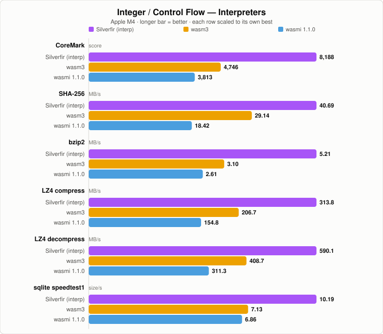
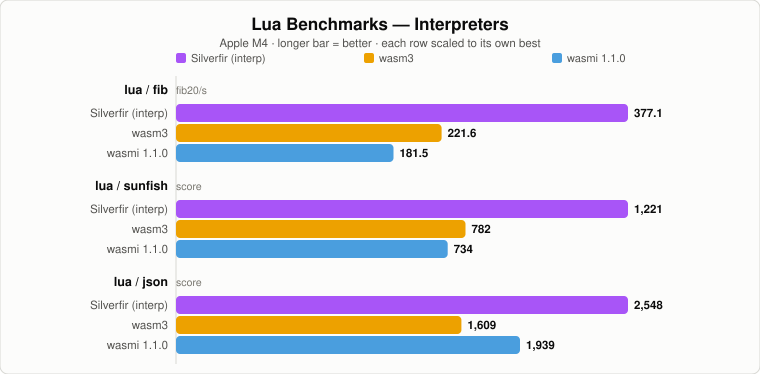
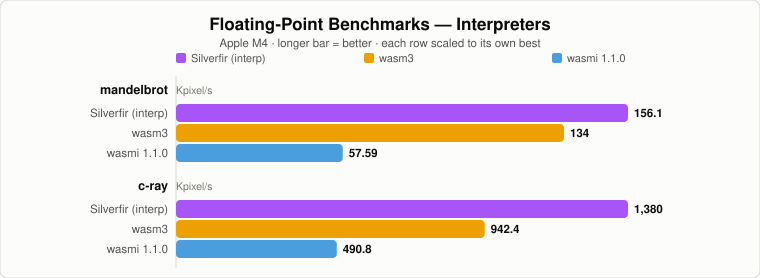
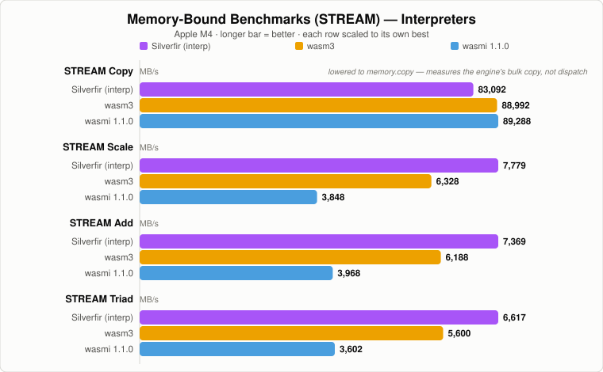

# WASI Benchmarks

Seven WebAssembly runtimes on an Apple M4, measured 2026-07-24: Silverfir's JIT
and interpreter, Wasmtime Cranelift 47.0.2, V8 TurboFan (Node.js 25.9), Wasmtime
Winch 47.0.2, wasm3, and wasmi 1.1.0. Winch was added and the Silverfir
interpreter re-measured on 2026-07-25.

Every metric is a **rate — higher is better**. Each benchmark self-times to a
wall-clock target (2 s by default) and reports work per second, so a run costs
about the same on any engine and the numbers stay comparable across a 20× spread
in speed.

The compiled and interpreted engines get **separate charts**: a compiler is ~7×
an interpreter here, so putting both on one scale would crush the interpreter
bars into slivers and hide the comparison that matters for each class. Winch is
wasmtime's baseline (single-pass) compiler, so it rides the compiled chart but
lands about halfway to the interpreters — that gap *is* the optimizing tier.

**[Full tables, method, and caveats → RESULTS.md](RESULTS.md)**

## Integer / Control Flow




## Lua Interpreter




## Floating Point




## Memory Bound (STREAM)




STREAM Copy is the one row that no longer measures the engine: the current clang
lowers the copy loop to a bulk `memory.copy`, so every runtime ends up in the
host's `memcpy`. It is kept because it is still a fair comparison of each
engine's bulk-copy path — see the footnote in
[RESULTS.md](RESULTS.md#memory-bound).

## Where Silverfir stands

Against the other **optimizing compilers** it is at parity: best-of-four over
the 15 metrics is Cranelift 9, Silverfir 4, V8 2, Winch 0. It leads on SHA-256
(+16%) and bzip2 (+14%), ties CoreMark and mandelbrot, and trails Cranelift by
6–9% on the Lua benchmarks. It beats V8 clearly on numeric code (mandelbrot
1.68×, STREAM Scale 1.96×).

**Winch** takes no row, as expected of a baseline compiler: a median 0.47× of
Cranelift and 0.46× of Silverfir's JIT, over a wide 0.27–0.98× spread. It is
still a median 2.93× of Silverfir's interpreter — except on mandelbrot, where
that lead narrows to 1.11×.

Its **interpreter** wins every dispatch-sensitive benchmark — 14 of 15 metrics —
by 1.16–1.73× over wasm3 and 1.31–2.89× over wasmi.

## Running them

```sh
python3 run_tests.py                 # this repo, JIT, 2s per benchmark
python3 run_tests.py --interp        # this repo, interpreter
python3 run_tests.py --time 10       # longer target, for formal runs
python3 run_tests.py --exec "<path>/wasmtime run" --cli-args "--dir ."
python3 run_tests.py --exec "<path>/wasmtime run" --cli-args "-C compiler=winch --dir ."
python3 run_tests.py --exec "<path>/wasm3"
python3 run_tests.py --exec "$HOME/.cargo/bin/wasmi_cli" --cli-args "--dir . --"
node run_v8.mjs --time 2             # V8 via Node's WASI
make                                 # rebuild every .wasm from source
python3 gen_svg.py                   # redraw the charts from RESULTS.md
```

`gen_svg.py` reads its numbers out of the RESULTS.md tables, so the charts and
the tables cannot disagree — update the table, re-run it, done.
