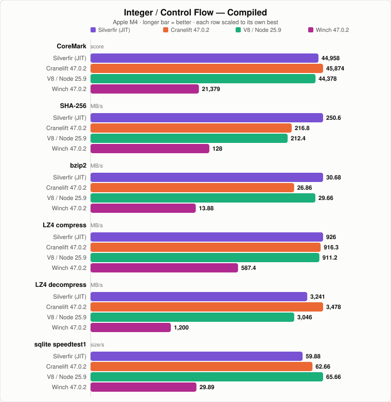
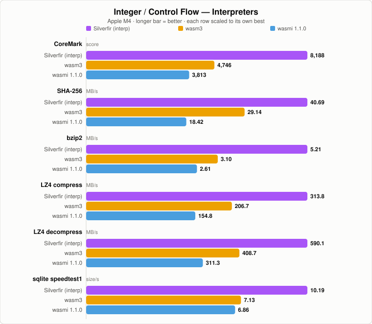
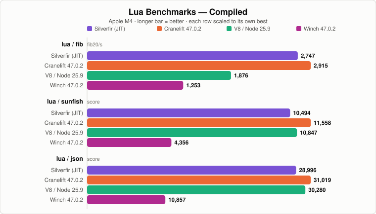
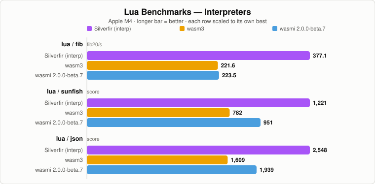
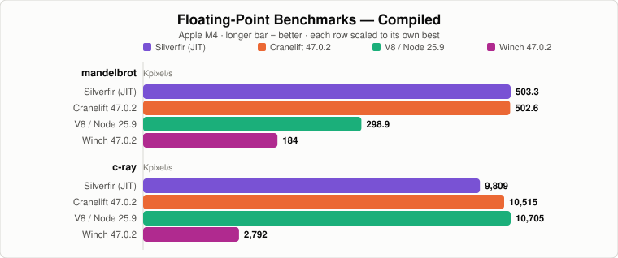
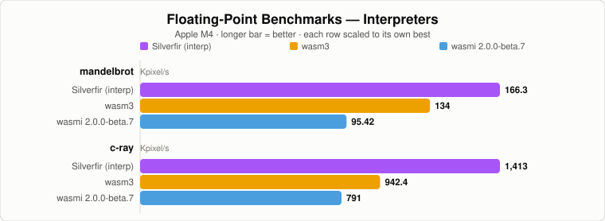
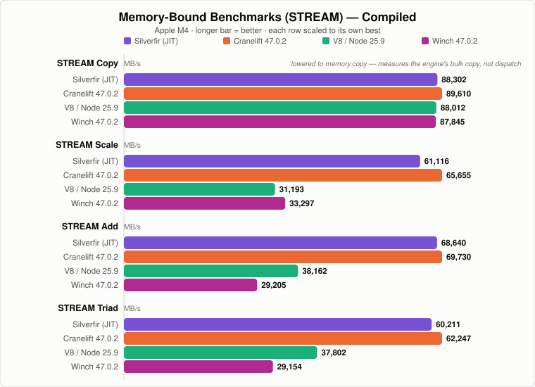
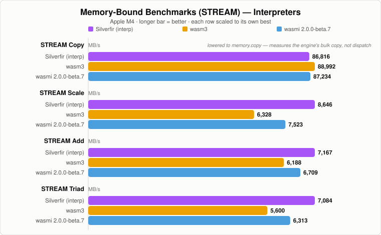

# WASI Benchmarks

Seven WebAssembly runtimes on an Apple M4, measured 2026-07-24: Silverfir's JIT
and interpreter, Wasmtime Cranelift 47.0.2, V8 TurboFan (Node.js 25.9), Wasmtime
Winch 47.0.2, wasm3, and wasmi 2.0.0-beta.7. Winch was added and the Silverfir
interpreter re-measured on 2026-07-25; wasmi moved from 1.1.0 to 2.0.0-beta.7
on 2026-07-26. The interpreter CoreMark row was refreshed on 2026-08-31 with
the current reported scores; its wasmi entry uses 2.0.0-beta.10.

Every metric is a **rate — higher is better**. The benchmarks self-time to a
wall-clock target (2 s by default) and report work per second, so a regression
suite costs about the same on any engine and the numbers stay comparable across
a 20× spread in speed. The harness invokes CoreMark's explicit non-standard
regression mode for this bounded run. The refreshed interpreter CoreMark row is
the sole exception and shows the current standalone scores. CoreMark's source
and bare command line remain compatible with upstream EEMBC CoreMark: without
the option, its own calibration runs the measured interval for at least 10
seconds and emits the official result format.

The compiled and interpreted engines get **separate charts**: a compiler is ~7×
an interpreter here, so putting both on one scale would crush the interpreter
bars into slivers and hide the comparison that matters for each class. Winch is
wasmtime's baseline (single-pass) compiler, so it rides the compiled chart but
lands about halfway to the interpreters — that gap *is* the optimizing tier.

**[Full tables, method, and caveats → RESULTS.md](RESULTS.md)**

## Integer / Control Flow





## Lua Interpreter





## Floating Point





## Memory Bound (STREAM)





STREAM Copy is the one row that no longer measures the engine: the current clang
lowers the copy loop to a bulk `memory.copy`, so every runtime ends up in the
host's `memcpy`. It is kept because it is still a fair comparison of each
engine's bulk-copy path — see the footnote in
[RESULTS.md](RESULTS.md#memory-bound).

## Where Silverfir stands

Against the other **optimizing compilers** it is at parity: best-of-four over
the 15 metrics is Cranelift 9, Silverfir 4, V8 2, Winch 0. It leads on SHA-256
(+16%) and bzip2 (+14%), ties CoreMark and mandelbrot, and trails Cranelift by
6–9% on the Lua benchmarks. It beats V8 clearly on numeric code (mandelbrot
1.68×, STREAM Scale 1.96×).

**Winch** takes no row, as expected of a baseline compiler: a median 0.47× of
Cranelift and 0.46× of Silverfir's JIT, over a wide 0.27–0.98× spread. It is
still a median 2.93× of Silverfir's interpreter — except on mandelbrot, where
that lead narrows to 1.11×.

Its **interpreter** wins every dispatch-sensitive benchmark — 14 of 15 metrics —
by 1.16–2.01× over wasm3 and 1.07–2.41× over wasmi 2.0. The two rivals
trade places by benchmark, so the margin over whichever is faster on each row is
**1.07–1.69×**, median ~1.39×: wasmi 2.0 is the closer one on CoreMark, the
STREAM arithmetic kernels and Lua; wasm3 is closer on bzip2, LZ4 and the float
pair.

## Running them

```sh
python3 run_tests.py                 # JIT; 2s self-calibrated tests
python3 run_tests.py --interp        # this repo, interpreter
python3 run_tests.py --time 10       # 10s per benchmark
python3 run_tests.py --exec "<path>/wasmtime run" --cli-args "--dir ."
python3 run_tests.py --exec "<path>/wasmtime run" --cli-args "-C compiler=winch --dir ."
python3 run_tests.py --exec "<path>/wasm3"
python3 run_tests.py --exec "$HOME/.cargo/bin/wasmi" --cli-args "--dir . --"   # 2.0: binary is `wasmi`
node run_v8.mjs --time 2             # V8 via Node's WASI
make                                 # rebuild every .wasm from source
python3 gen_svg.py                   # redraw the charts from RESULTS.md
```

`run_tests.py` passes `--target-seconds=<seconds>` to CoreMark. This keeps CI
and local regression runs bounded, separates calibration from the reported
sample, and labels the result as non-standard. Invoke `coremark.wasm` without
that option when producing an official CoreMark result; the default upstream
10-second-minimum behavior is unchanged.

`gen_svg.py` reads its numbers out of the RESULTS.md tables, so the charts and
the tables cannot disagree — update the table, re-run it, done. Every chart it
draws is written to [`assets/`](../../assets) at the repo root, the one place
this project keeps rendered images; the pages here and the top-level README
both link into it.

Nine files come out of a run: the eight above, plus
[`assets/coremark.svg`](../../assets/coremark.svg), the summary the top-level
README leads with. That one compares the three interpreters on a single shared
scale and orders them fastest-first. The refreshed CoreMark row in the larger
interpreter chart uses the same ordering; its other rows retain their stable
runtime order.
